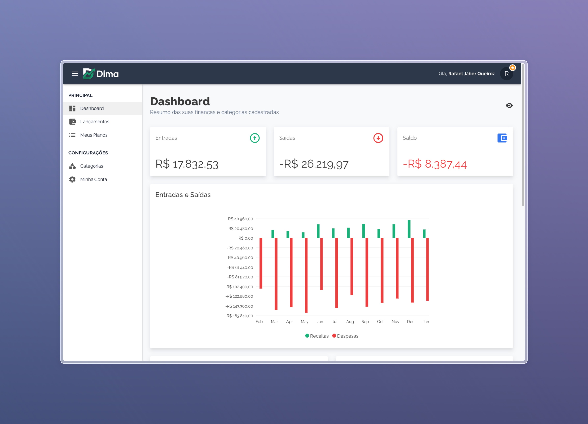
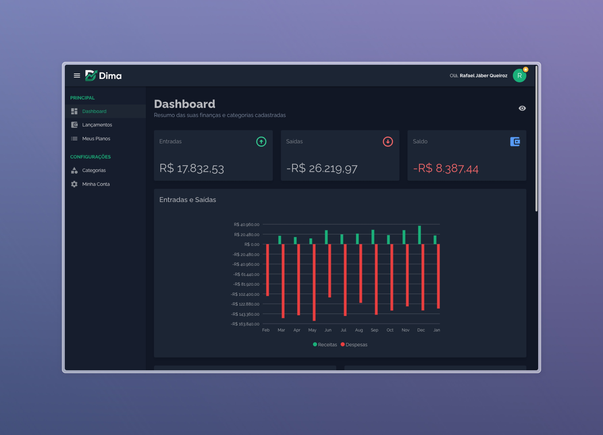
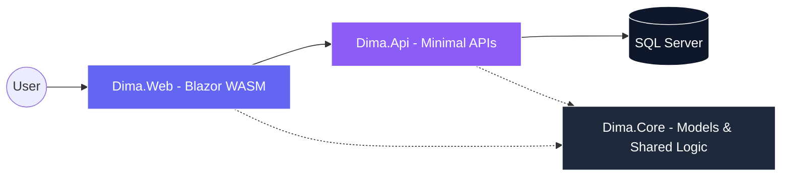

<div align="center">

# 💎 DIMA: Elite Financial Ecosystem
### *Modern Management — Empowering Your Financial Journey*


[](https://dotnet.microsoft.com/)
[](https://dotnet.microsoft.com/apps/aspnet/web-apps/blazor)
[](https://mudblazor.com/)
[](https://www.docker.com/)

[Features](#-key-features) • [Tech Stack](#-technology-stack) • [Architecture](#-architecture--design) • [Quick Start](#-quick-start)

</div>

---

## 🏛️ Overview

**DIMA** is a high-performance personal finance management platform designed for users who demand precision, security, and a premium user experience. Built with the latest .NET 10 ecosystem, the project prioritizes **SOLID principles**, architectural robustness, and professional-grade UI/UX.

This version features a modernized **Indigo & Violet** aesthetic, decoupled security layers, and an automated data seeding engine to provide a seamless "Out of the Box" experience.

---

## 📸 Interface Experience

<div align="center">

### 📊 Professional Dashboard
| Light Mode (Indigo) | Dark Mode (Slate) |
| :---: | :---: |
|  |  |

</div>

---

## ✨ Key Features

| Feature | Description | Status |
| :--- | :--- | :---: |
| **🛡️ SOLID Identity** | Decoupled authentication system with custom registration and secure session handling. | ✅ |
| **📈 Dynamic Analytics** | Real-time interactive charts for income, expenses, and category-based distribution. | ✅ |
| **💳 Stripe Integration** | Full checkout flow for premium subscriptions and order management. | ✅ |
| **🌱 Smart Seeding** | User-choice demo data generation upon registration for immediate exploration. | ✅ |
| **🎨 Modern UI/UX** | Refined typography (Inter), rounded aesthetics, and smooth CSS transitions. | ✅ |
| **🚢 Containerized** | Full Docker support for both API and Frontend with CI/CD GitHub Actions. | ✅ |

---

## 🛠️ Technology Stack

### 🚀 **Frontend: Blazor WebAssembly**
Powered by .NET 10, the frontend executes directly in the browser via WebAssembly. This ensures a strictly typed Single Page Application (SPA) experience with near-native performance.

### ⚡ **Backend: ASP.NET Core & Minimal APIs**
A lightweight and ultra-fast backend architecture. We leveraged Minimal APIs to reduce overhead and focus on high-concurrency performance and clean endpoint definitions.

### 💾 **Data: EF Core & SQL Server**
Uses Entity Framework Core for robust Object-Relational Mapping (ORM). Advanced dashboard views are managed directly via **EF Migrations** to ensure database schema consistency across environments.

### 🧩 **UI: MudBlazor & Custom CSS**
A premium component library enhanced with custom Indigo-theme transitions, modern hover effects, and optimized data tables for a true 'Fintech' look and feel.

---

## 🏗️ Architecture & Design

The project follows a clean **Layered Architecture**, ensuring that business logic is separated from infrastructure and presentation concerns.



### 📂 Repository Structure
- **Dima.Web**: The interactive client-side application.
- **Dima.Api**: High-performance backend services and security handlers.
- **Dima.Core**: Shared contracts, enums, and domain models.

---

## 🚥 Quick Start

### 1. Using Docker (Recommended)
```bash
docker-compose up -d
```

### 2. Manual Run
```bash
# Restore and Build
dotnet build

# Run API
dotnet run --project Dima.Api

# Run Web
dotnet run --project Dima.Web
```

---

<div align="center">

Crafted with technical excellence by **[Israel Anacleto]**.
</div>
