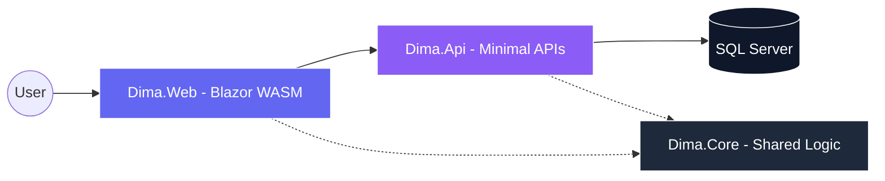

<div align="center">

# 💎 DIMA: Elite Financial Ecosystem
### *Modern Management — Empowering Your Financial Journey*
### *Gestão Moderna — Potencializando sua Jornada Financeira*


[](https://dotnet.microsoft.com/)
[](https://dotnet.microsoft.com/apps/aspnet/web-apps/blazor)
[](https://mudblazor.com/)
[](https://www.docker.com/)

[Features / Funcionalidades](#-key-features--funcionalidades-chave) • [Tech Stack / Tecnologias](#-technology-stack--stack-tecnológica) • [Architecture / Arquitetura](#-architecture--design--arquitetura-e-design) • [Quick Start / Início Rápido](#-quick-start--início-rápido)

</div>

---

## 🏛️ Overview / Visão Geral

**DIMA** is a high-performance personal finance management platform designed for users who demand precision, security, and a premium experience. Built with the latest .NET 10 ecosystem, it prioritizes **SOLID principles**, architectural robustness, and professional-grade UI/UX.

**DIMA** é uma plataforma de gestão financeira pessoal de alta performance, projetada para usuários que exigem precisão, segurança e uma experiência premium. Construído com o ecossistema .NET 10, prioriza os **princípios SOLID**, robustez arquitetônica e UI/UX de nível profissional.

---

## 📸 Interface Experience / Experiência de Interface

<div align="center">

### 📊 Professional Dashboard / Dashboard Profissional
| Light Mode (Indigo) | Dark Mode (Slate) |
| :---: | :---: |
|  |  |

</div>

---

## ✨ Key Features / Funcionalidades Chave

| Feature / Funcionalidade | Description / Descrição | Status |
| :--- | :--- | :---: |
| **🛡️ SOLID Identity** | Decoupled auth system with custom registration. / Sistema de autenticação desacoplado. | ✅ |
| **📈 Dynamic Analytics** | Real-time interactive financial charts. / Gráficos financeiros interativos em tempo real. | ✅ |
| **💳 Stripe Integration** | Full checkout flow for premium plans. / Fluxo completo de checkout para planos premium. | ✅ |
| **🌱 Smart Seeding** | User-choice demo data generation. / Geração de dados de demonstração por escolha do usuário. | ✅ |
| **🎨 Modern UI/UX** | Indigo theme with Inter typography. / Tema Indigo com tipografia Inter. | ✅ |
| **🚢 Containerized** | Full Docker support & CI/CD. / Suporte total a Docker e CI/CD. | ✅ |

---

## 🛠️ Technology Stack / Stack Tecnológica

*   **Frontend**: Blazor WebAssembly (.NET 10) for a native-like SPA experience. / Blazor WASM para uma experiência SPA fluida.
*   **Backend**: ASP.NET Core Minimal APIs for high-performance services. / Minimal APIs para serviços de alta performance.
*   **Data**: EF Core & SQL Server with automated Migrations. / EF Core e SQL Server com Migrations automatizadas.
*   **UI/UX**: MudBlazor components with custom CSS refinements. / Componentes MudBlazor com refinamentos CSS customizados.

---

## 🏗️ Architecture & Design / Arquitetura e Design

The project follows a clean **Layered Architecture**, ensuring separation of concerns.
O projeto segue uma **Arquitetura em Camadas**, garantindo a separação de responsabilidades.



---

## 🚥 Quick Start / Início Rápido

### 1. Using Docker / Usando Docker (Recommended)
```bash
docker-compose up -d
```

### 2. Manual Run / Execução Manual
```bash
# Restore and Build / Restaurar e Compilar
dotnet build

# Run API / Executar API
dotnet run --project Dima.Api

# Run Web / Executar Web
dotnet run --project Dima.Web
```

---

<div align="center">

Crafted with technical excellence by / Desenvolvido com excelência técnica por **[Israel Anacleto]**.
</div>
