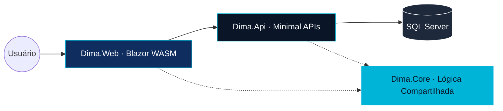

<div align="center">

# DIMA — Plataforma Financeira

### Gestão moderna de finanças pessoais com nível corporativo


[](https://dotnet.microsoft.com/)
[](https://dotnet.microsoft.com/apps/aspnet/web-apps/blazor)
[](https://mudblazor.com/)
[](https://www.docker.com/)

[Funcionalidades](#-funcionalidades) • [Stack](#-stack-tecnológica) • [Arquitetura](#-arquitetura) • [Início Rápido](#-início-rápido)

</div>

---

## Visão Geral

**DIMA** é uma plataforma de gestão financeira pessoal construída com foco em experiência corporativa. O projeto vai além do controle de gastos — apresenta uma landing page institucional, dashboard analítico, gestão de categorias, transações, planos de assinatura e integração com Stripe.

Desenvolvido como projeto de portfólio para demonstrar domínio em arquitetura Blazor WASM, design systems e integração de APIs financeiras.

---

## Funcionalidades

| Funcionalidade | Descrição | Status |
| :--- | :--- | :---: |
| **Landing Page** | Homepage institucional com hero, features, planos e CTA | ✅ |
| **Autenticação** | Registro, login e logout com Identity desacoplado | ✅ |
| **Dashboard** | Visão de saldo, receitas, despesas e gráficos por categoria | ✅ |
| **Transações** | Cadastro, edição e listagem de entradas e saídas | ✅ |
| **Categorias** | Organização por categorias com grid visual | ✅ |
| **Planos** | Cards de assinatura Free e Premium | ✅ |
| **Stripe** | Fluxo completo de checkout para upgrade de plano | ✅ |
| **Modo Escuro** | Dark mode com paleta Navy refinada | ✅ |
| **Seed de Dados** | Geração de dados demo no cadastro | ✅ |
| **Docker** | Containerização completa com docker-compose | ✅ |

---

## Stack Tecnológica

- **Frontend**: Blazor WebAssembly (.NET 10) — SPA com render client-side
- **Backend**: ASP.NET Core Minimal APIs — endpoints de alta performance
- **Banco de Dados**: EF Core + SQL Server com Migrations automatizadas
- **UI/UX**: MudBlazor com design system customizado (Navy `#0F2D5E` + Cyan `#00B4D8`)
- **Tipografia**: Inter (interface) + JetBrains Mono (valores financeiros)
- **Pagamentos**: Stripe Checkout integrado via JS Interop

---

## Arquitetura

O projeto segue **Arquitetura em Camadas** com separação clara de responsabilidades:



---

## Início Rápido

### Docker (recomendado)
```bash
docker-compose up -d
```

### Execução Manual
```bash
# Compilar solução
dotnet build

# Executar API
dotnet run --project Dima.Api

# Executar Web (em outro terminal)
dotnet run --project Dima.Web
```

---

<div align="center">

Desenvolvido por **Israel Anacleto**

</div>
