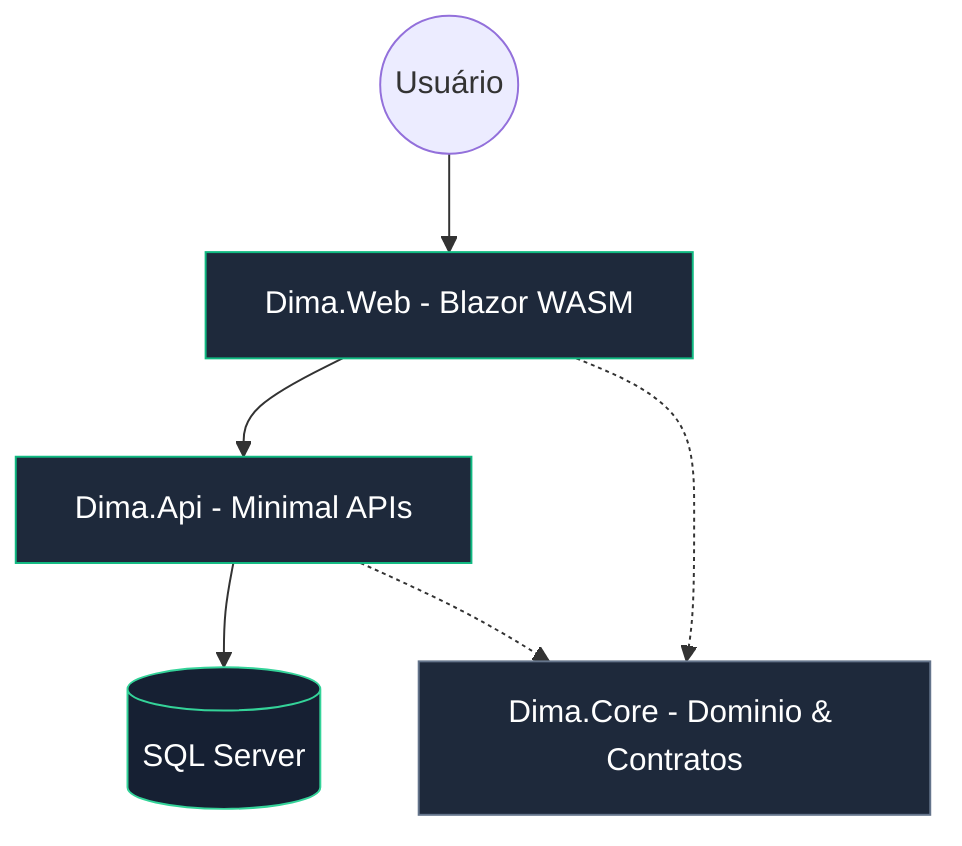

<div align="center">

# 💎 DIMA
### *Sober Fintech Elite — Elevando sua Gestão Financeira*


[](https://dotnet.microsoft.com/)
[](https://dotnet.microsoft.com/apps/aspnet/web-apps/blazor)
[](https://mudblazor.com/)
[](https://www.docker.com/)

[Funcionalidades](#-funcionalidades-premium) • [Tecnologias](#-deep-dive-tecnológico) • [Arquitetura](#-arquitetura-e-design) • [Execução](#-execução-rápida)

</div>

---

## 🏛️ Visão Geral

O **Dima** é uma plataforma de gestão financeira pessoal de alta performance, projetada para quem valoriza sobriedade, precisão e uma experiência de usuário de nível "Fintech Elite". 

Construído com o estado da arte do ecossistema .NET, o projeto prioriza a **robustez técnica** e a **manutenibilidade**, utilizando uma arquitetura moderna que separa claramente as responsabilidades entre cliente, API e domínio.

---

## ✨ Funcionalidades Premium

| Funcionalidade | Descrição | Status |
| :--- | :--- | :---: |
| **💼 Identity System** | Autenticação completa via JWT com gerenciamento de perfil e tokens seguros. | ✅ |
| **📈 Dashboard Central** | Agregação automática de saldos e fluxo de caixa para tomada de decisão. | ✅ |
| **🔖 Smart Categories** | Organização inteligente de transações através de um sistema flexível de categorias. | ✅ |
| **💸 Precision Flow** | Lançamentos financeiros detalhados com suporte a diferentes tipos de movimentação. | ✅ |
| **🎨 Sober Theme** | Design adaptativo com paleta Deep Navy & Emerald para o máximo conforto visual. | ✅ |
| **📱 Full Responsive** | Interface fluida e responsiva, garantindo a mesma qualidade no Mobile ou Desktop. | ✅ |

---

## 🛠️ Deep Dive Tecnológico

Em vez de apenas listar as ferramentas, aqui está o papel fundamental de cada tecnologia neste ecossistema:

### 🚀 **Blazor WebAssembly**
Utilizado como o motor do frontend, o Blazor WASM permite a execução de lógica C# diretamente no navegador através do WebAssembly. Isso garante um carregamento inicial rápido (após o cache), tipagem forte do início ao fim e uma experiência de Single Page Application (SPA) extremadamente fluida, aproximando a performance do web app de uma aplicação nativa.

### 🧩 **MudBlazor**
A biblioteca de componentes UI escolhida para elevar a estética do Dima. O MudBlazor fornece componentes baseados em Material Design com alto nível de customização via CSS isolado e temas em C#. Ele é o responsável pelas interações suaves, drawers elegantes e o suporte nativo ao modo dark que define a nossa estética "Fintech Elite".

### ⚡ **ASP.NET Core 10 & Minimal APIs**
O coração do backend. Optamos por **Minimal APIs** para reduzir a verbosidade e focar na performance. Esta abordagem arquitetônica permite definir endpoints de forma direta e performática, resultando em menor consumo de memória e tempos de resposta ultra-rápidos para o frontend.

### 💾 **Entity Framework Core & SQL Server**
A camada de persistência utiliza o EF Core para um mapeamento objeto-relacional (ORM) moderno e eficiente. Combinado com o SQL Server, garante integridade referencial, transações atômicas e uma base sólida para o crescimento dos dados financeiros do usuário.

### � **Docker & Docker Compose**
Toda a infraestrutura do projeto é containerizada. Isso garante que o ambiente de desenvolvimento seja idêntico ao de produção (ou staging). Com o Docker Compose, subimos o banco de dados e as dependências com um único comando, isolando o projeto de conflitos de versões no sistema operacional local.

---

## 🏗️ Arquitetura e Design



### 📂 Organização de Camadas
- **Dima.Web**: Interface rica e lógica de interação do usuário.
- **Dima.Api**: Serviço de backend, endpoints e segurança.
- **Dima.Core**: O "Single Source of Truth", contendo modelos, regras de negócio compartilhadas e contratos de API.

---

## 🚥 Execução Rápida

```bash
# 1. Subir infraestrutura
docker-compose up -d

# 2. Restaurar dependências e rodar
dotnet build
dotnet run --project Dima.Api
dotnet run --project Dima.Web
```

---

<div align="center">

Desenvolvido com excelência técnica por **[Rafael Jáber]**.
</div>
